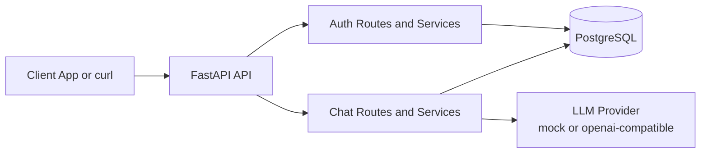
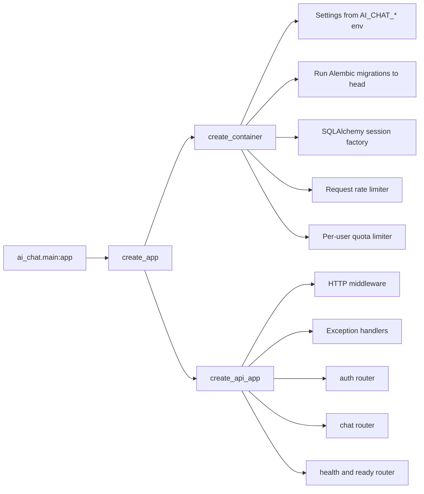
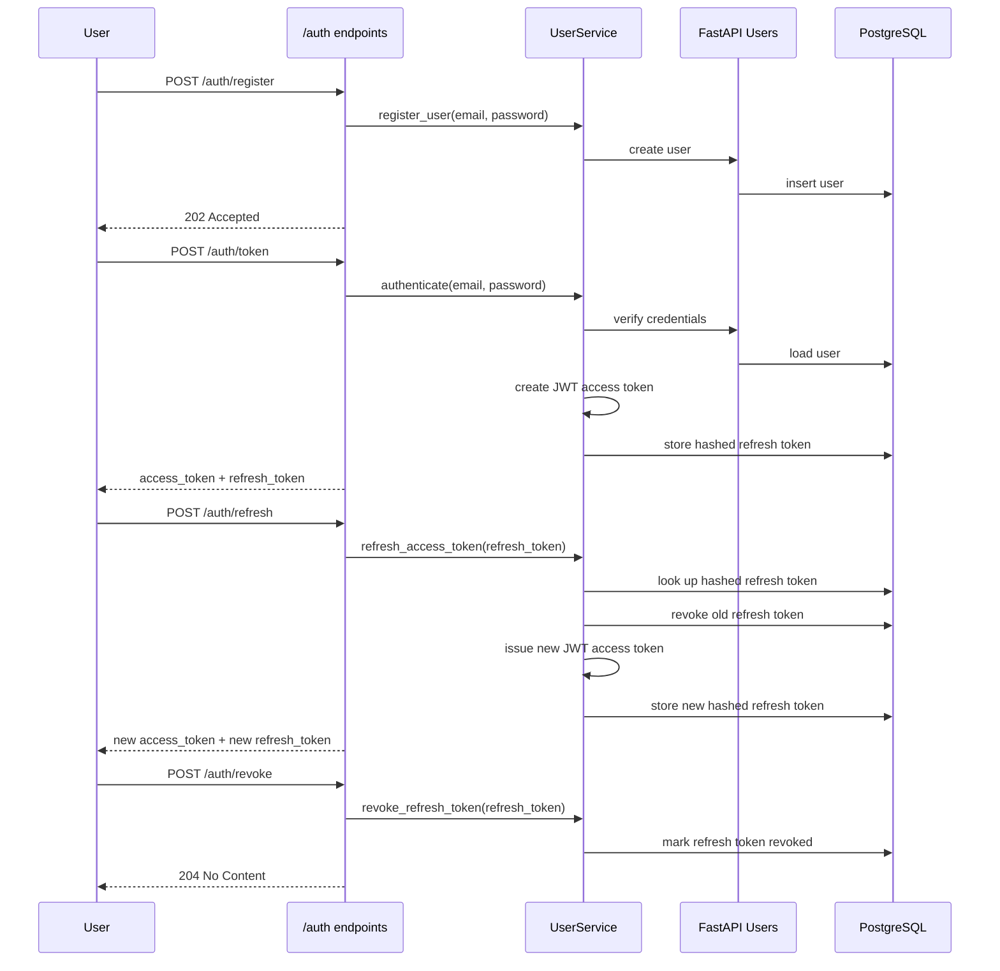
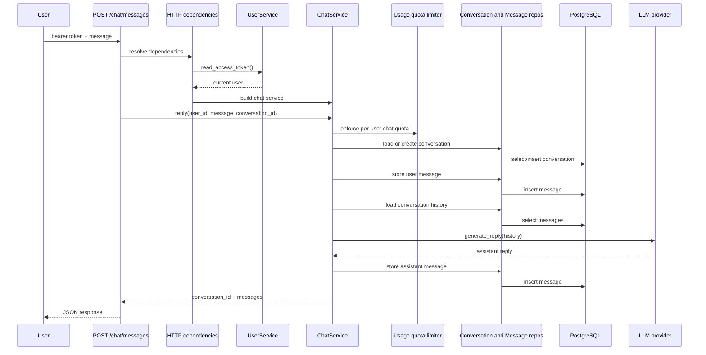
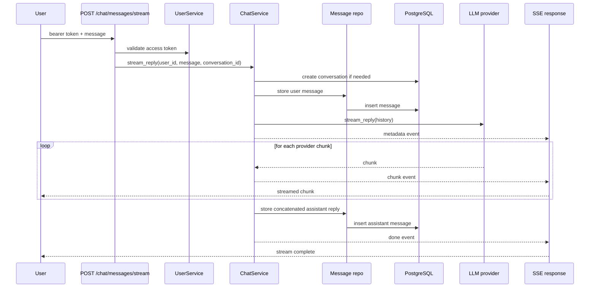
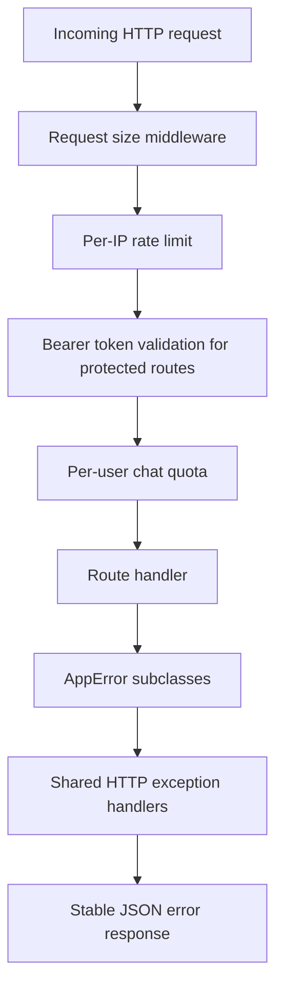
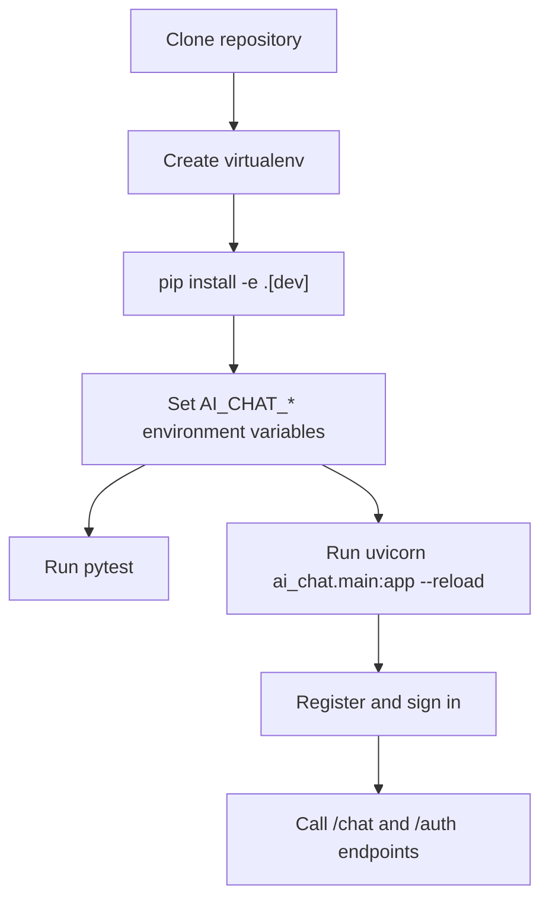
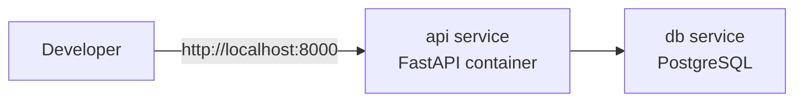
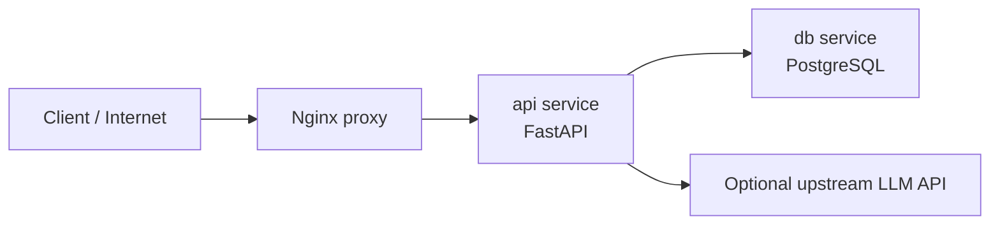

# AI Chat Backend Diagrams

This document uses Mermaid diagrams to explain what the project does, how requests move through the system, and how the service is typically run.

## 1. System Overview

The backend exposes authentication, chat, conversation-history, usage, health, and readiness endpoints. It stores users, refresh tokens, conversations, and messages in PostgreSQL. Chat replies come from a provider adapter, which is either the local mock provider or an OpenAI-compatible upstream accessed through the official OpenAI SDK.

## 2. Application Structure

At startup the app loads configuration, runs migrations, prepares the database/session infrastructure, and stores shared dependencies in the application container. Request-scoped services are built from that container.

## 3. Auth and Token Lifecycle

Access tokens are bearer JWTs. Refresh tokens are opaque secrets returned once, stored only as SHA-256 hashes, and rotated on refresh.

## 4. Synchronous Chat Request Flow

The sync endpoint persists both the user turn and the final assistant turn before returning the response.

## 5. Streaming Chat Request Flow

The streaming path sends SSE events in this order: `metadata`, repeated `chunk`, then `done`. The assistant message is saved only after the provider stream finishes.

## 6. Request Protection and Error Boundaries

The app rejects oversized bodies early, rate-limits high-risk routes by client IP, enforces per-user chat quotas for authenticated chat actions, and maps domain errors into stable JSON responses with `detail` and `code`.

## 7. How Developers Use the Project Locally

Typical local usage is: install dependencies, configure `AI_CHAT_DATABASE__URL`, `AI_CHAT_JWT__SECRET`, and `AI_CHAT_LLM__PROVIDER`, run tests, start Uvicorn, then exercise the API with `curl`, a frontend, or an API client.

## 8. Docker and Deployment Topology

### Local Compose

`docker-compose.yml` runs two services: the API and PostgreSQL.

### Production Compose

`docker-compose.prod.yml` puts Nginx in front of the API. The proxy handles external traffic, forwards headers, preserves SSE compatibility, and adds an extra deployment-layer request/connection guard before requests reach FastAPI.
