# Function And Class Call Diagrams

This document focuses on code-level interactions: which functions and classes call each other, and when those calls happen during startup and request handling.

## 1. Application Startup Call Graph

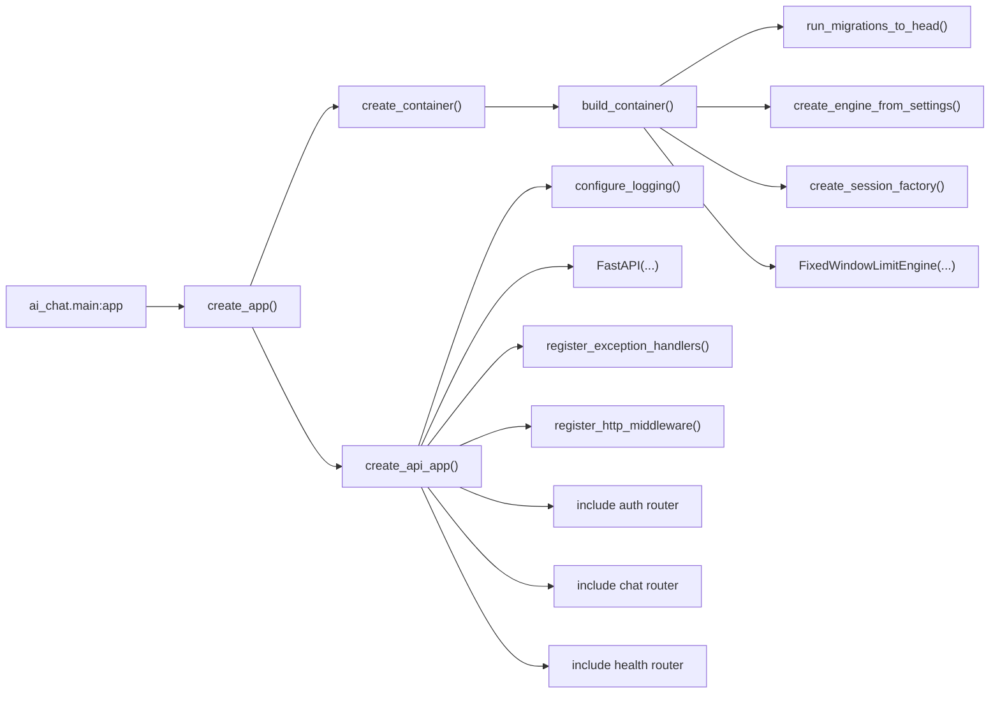

When the process starts, `create_app()` builds the shared container first, then builds the FastAPI app around that container.

## 2. Request Dependency Resolution

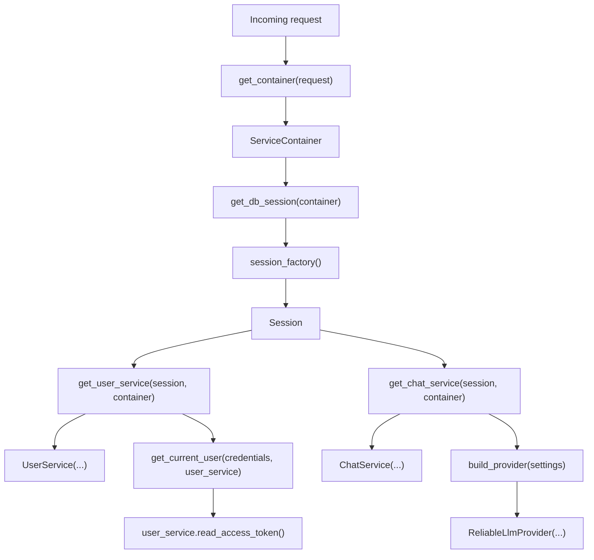

This is the shared path FastAPI uses before the route handler itself runs.

## 3. Auth Route Call Flow

### Register Route To UserService Boundary

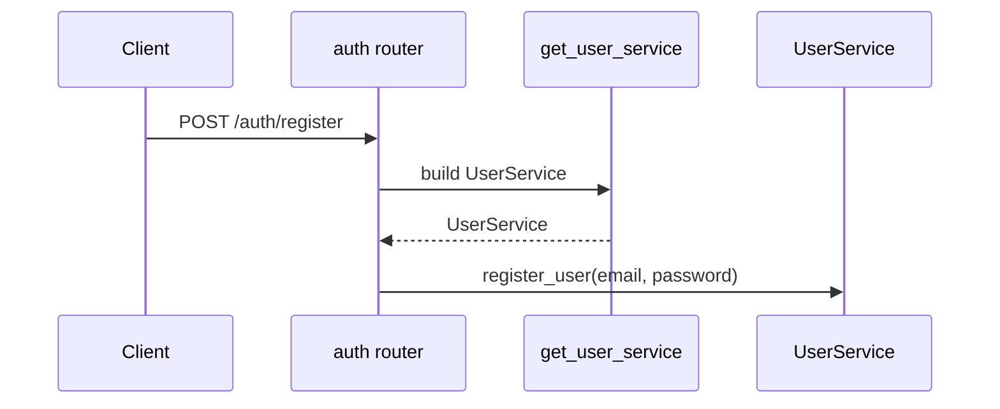

### Inside UserService.register_user()

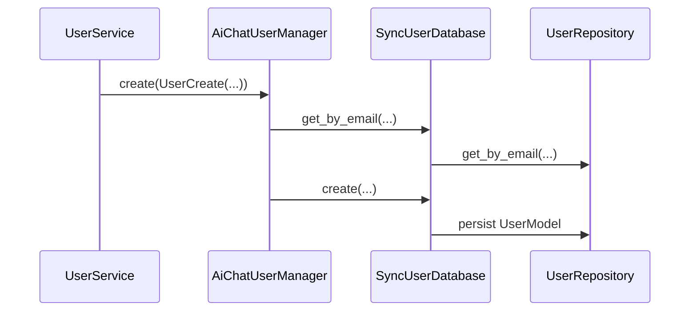

### Token Route To UserService Boundary

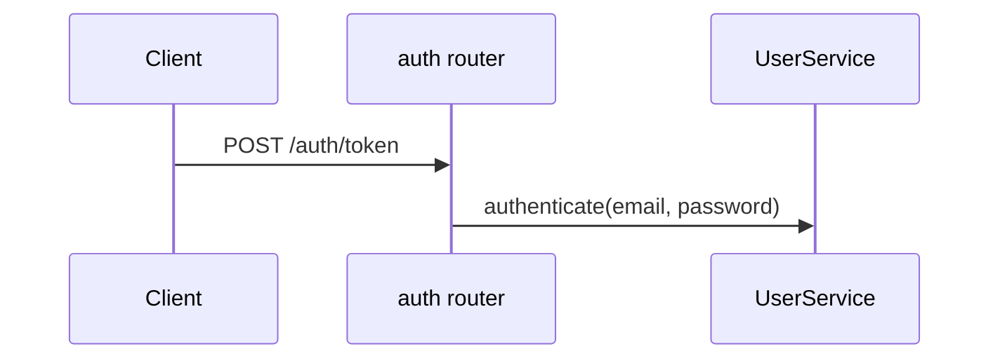

### Inside UserService.authenticate()

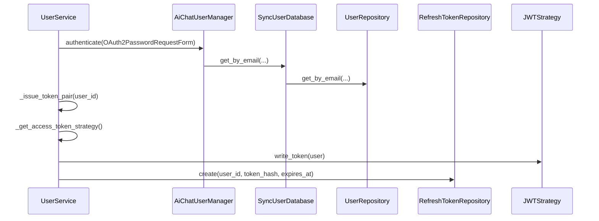

`/auth/refresh` and `/auth/revoke` reuse the same `UserService` but go through `RefreshTokenRepository` instead of the credential-authentication path.

## 4. Refresh And Revoke Call Flow

### Refresh Token Flow

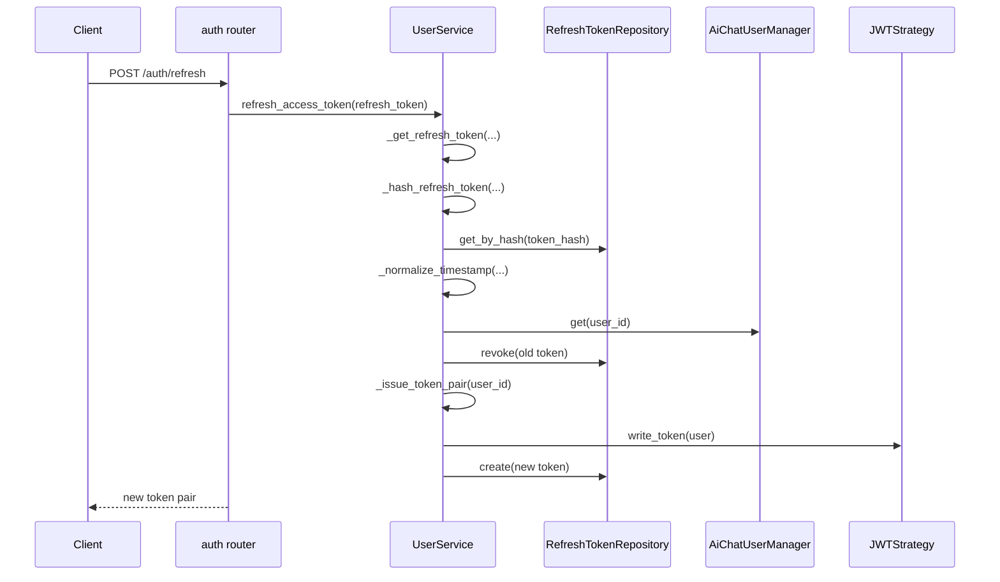

### Revoke Token Flow

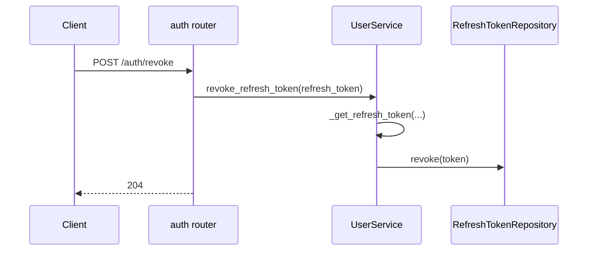

The refresh and revoke endpoints share the same internal refresh-token lookup path.

## 5. Synchronous Chat Call Flow

### Route To ChatService Boundary

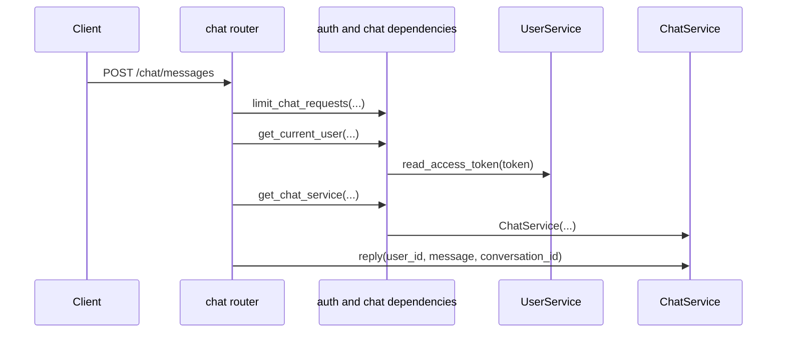

### Inside ChatService.reply()

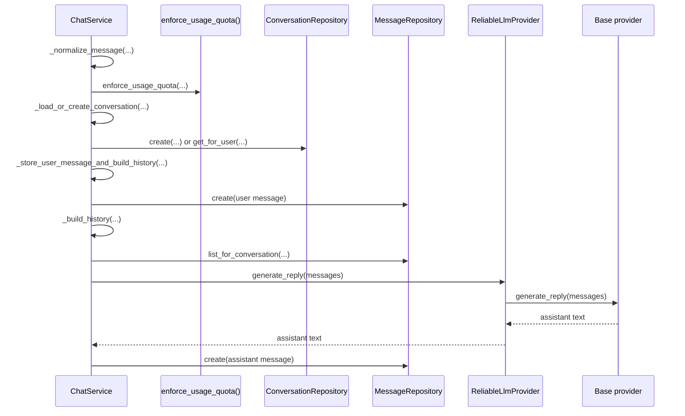

The first diagram ends when the route calls `ChatService.reply(...)`. The second shows the internal `ChatService` work: validation, quota enforcement, conversation lookup or creation, message persistence, provider invocation, and assistant-message persistence.

## 6. Streaming Chat Call Flow

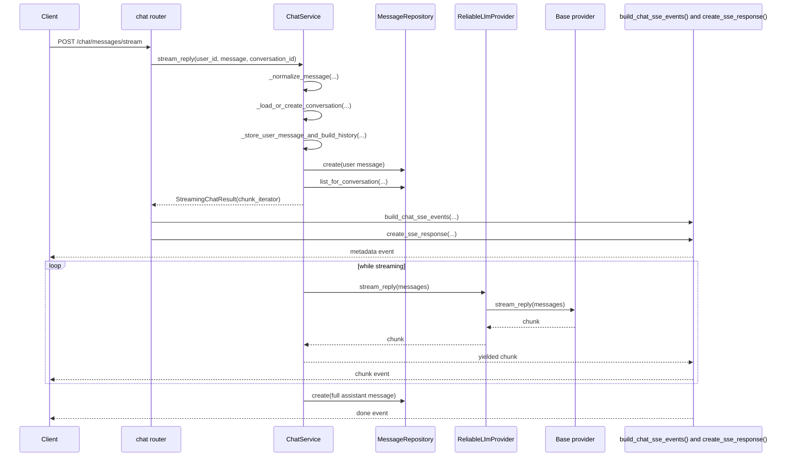

The assistant message is persisted only after the chunk iterator finishes collecting the full stream.

## 7. Provider Construction Call Graph

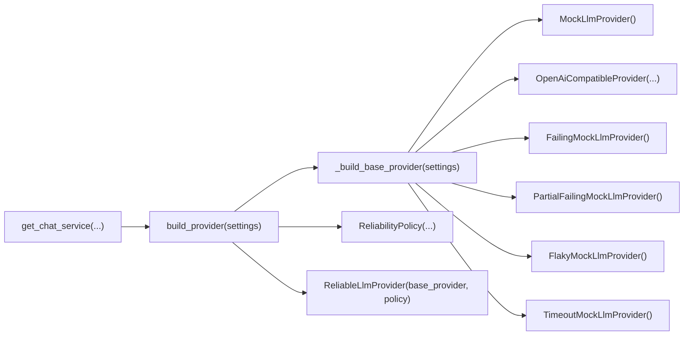

`ChatService` never talks directly to a concrete provider class. It always receives the reliability wrapper built by `build_provider()`.

## 8. Repository Call Map

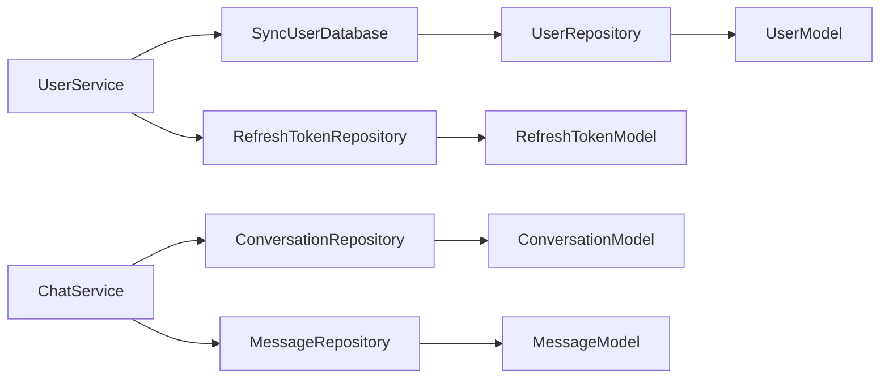

At the class level, services orchestrate work and repositories handle database persistence and loading.

## 9. Middleware And Error Handling Timing

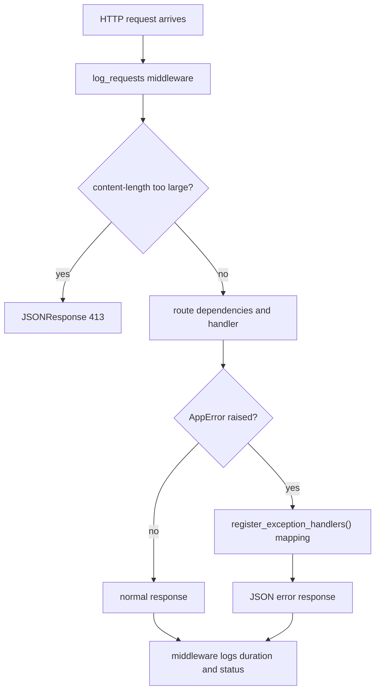

Middleware runs before and after the route handler. Exception handlers only take over if a route or service raises an application error.
