# RAG KnB Diagrams

This file explains the current package layout and the main runtime flows in `rag_knb`.

## 1. High-Level Structure

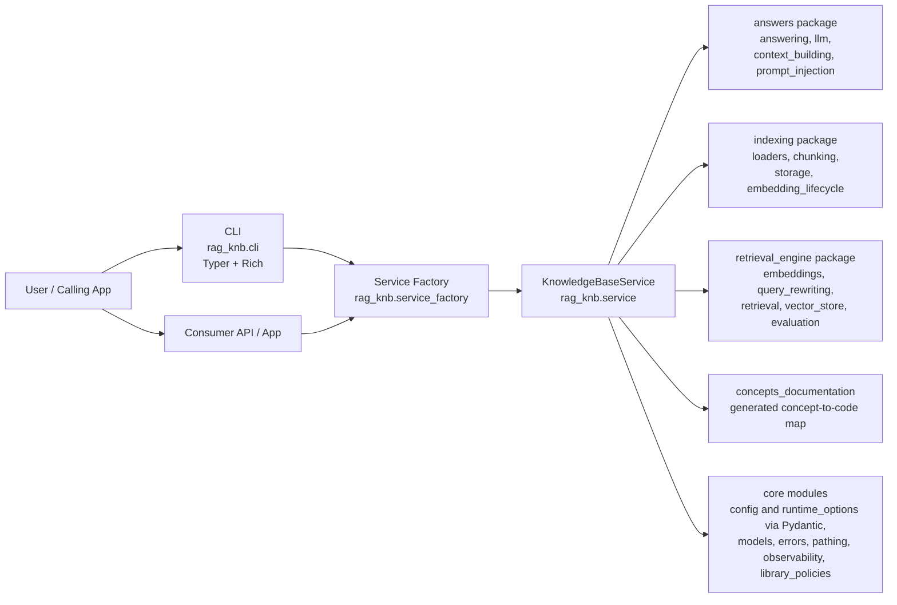

## 2. Package Layout

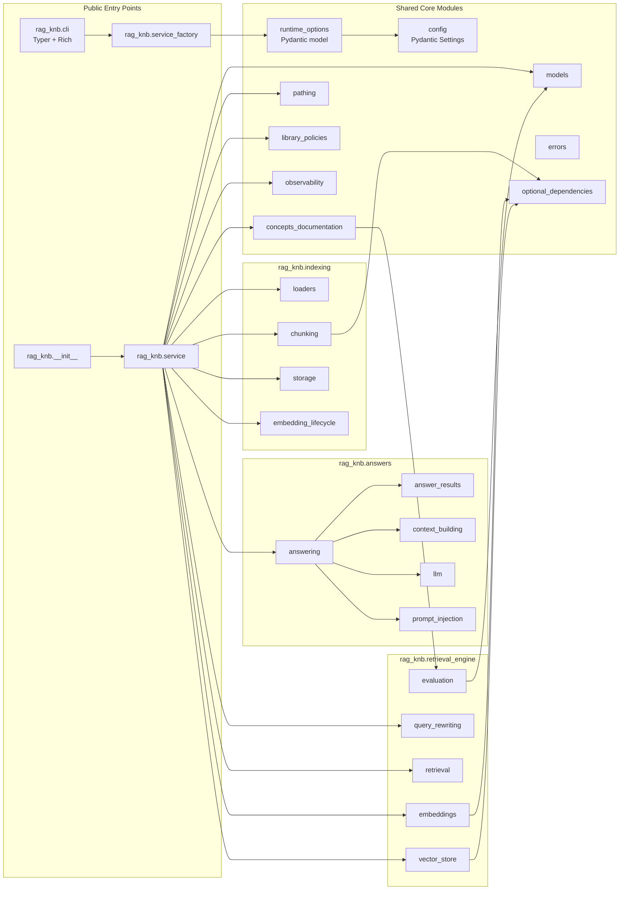

## 3. CLI Usage Flow

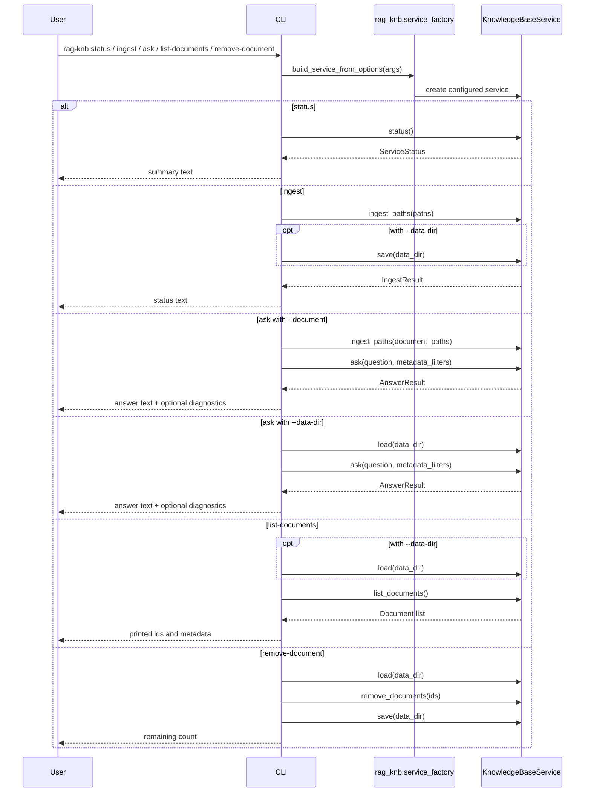

## 4. Ingest And Refresh Flow

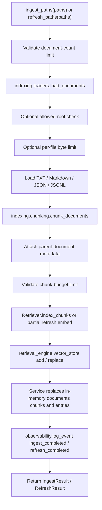

## 5. Query Flow

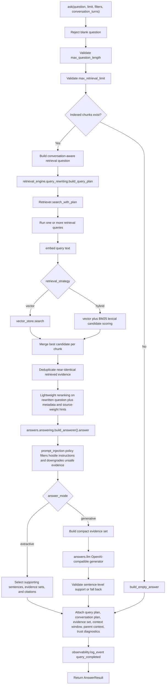

## 6. Evaluation And Comparison Flow

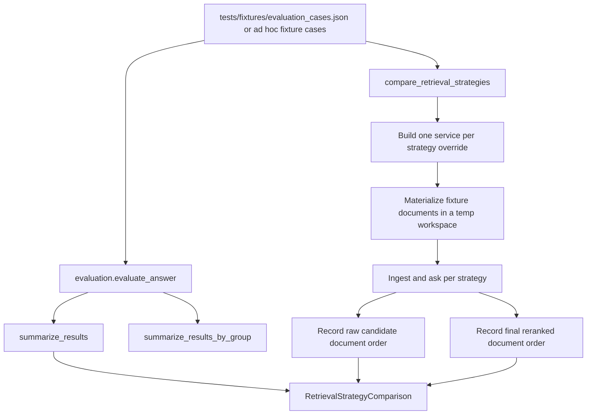

## 7. Coverage Summary

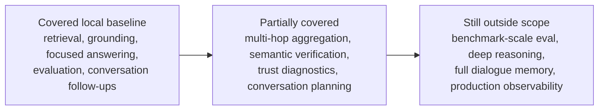

## 8. Persistence Flow

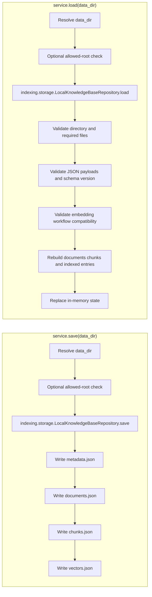

## 9. Optional Backend Paths

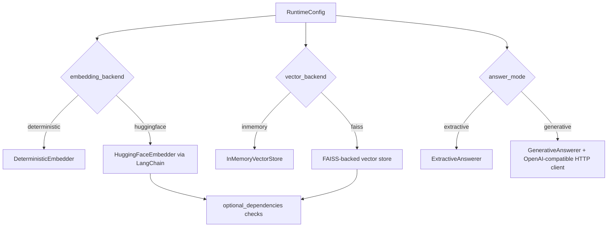

## 10. Concepts Documentation Flow

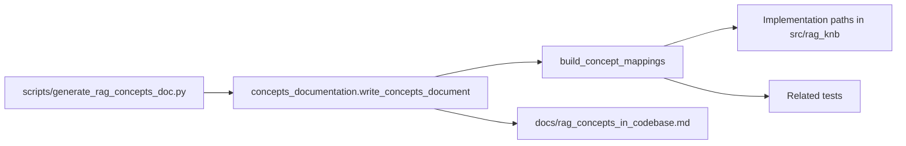

## 11. Integration Model

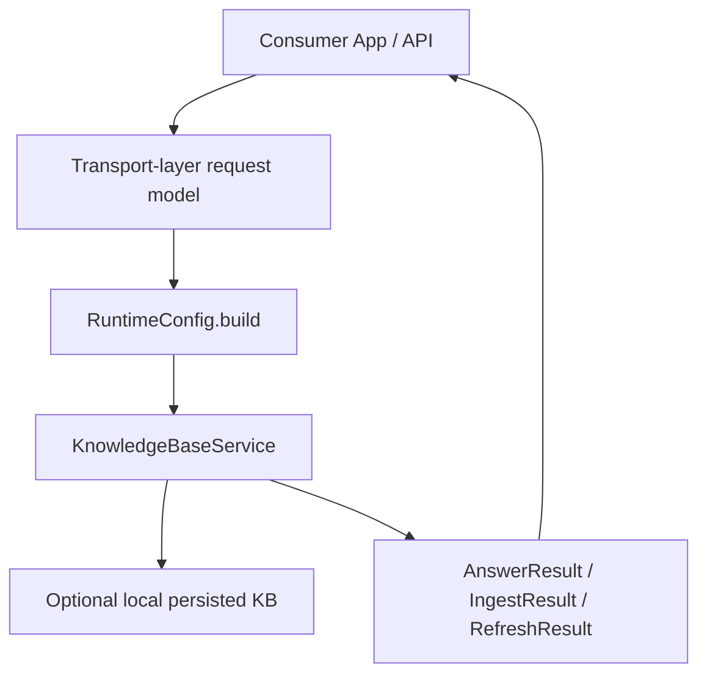
