# Call Diagrams

This file focuses on current call relationships between the main functions and classes in `rag_knb`.

## CLI Dispatch And Service Creation

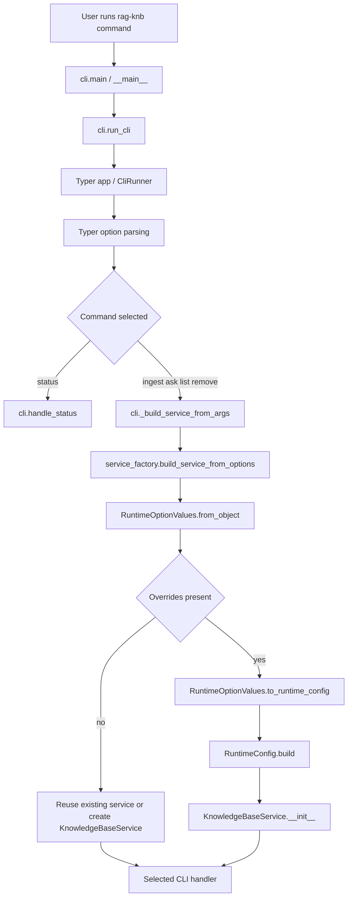

## KnowledgeBaseService Construction

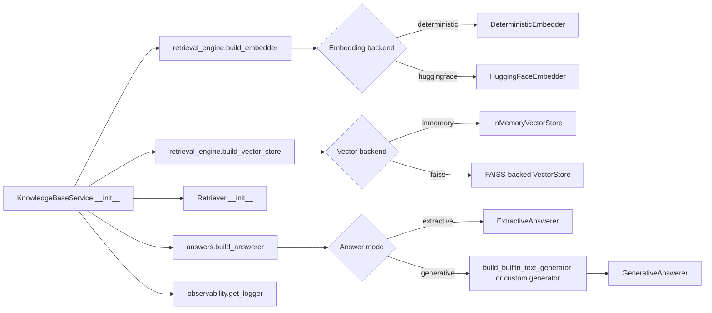

## Ingest Call Flow

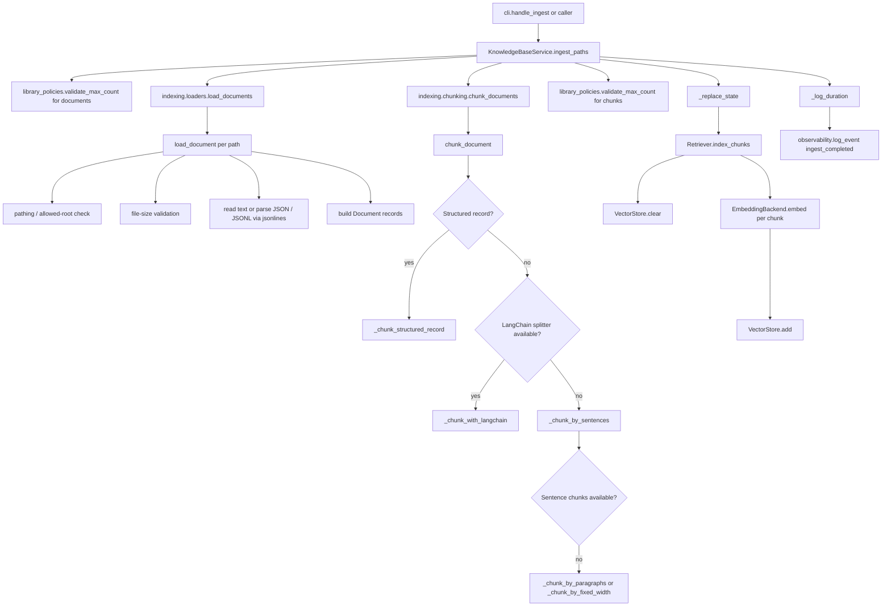

## Refresh Call Flow

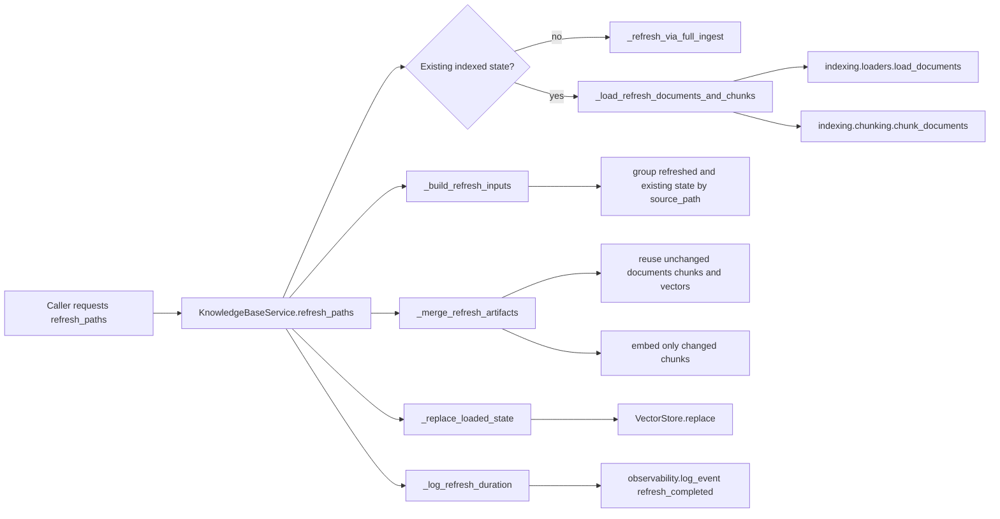

## Query And Answer Call Flow

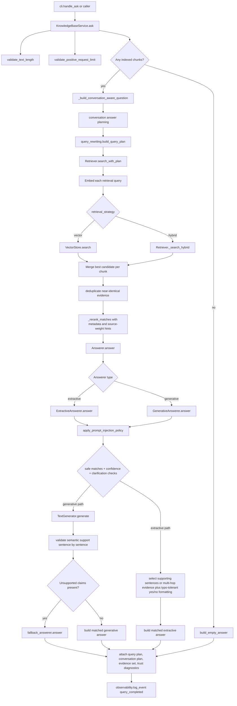

## Evaluation And Strategy Comparison Call Flow

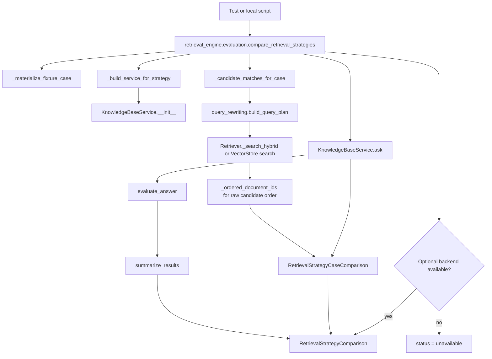

## Generative LLM Call Flow

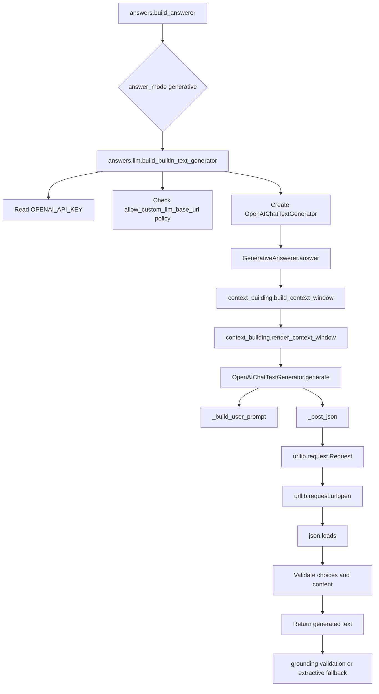

## Save, Load, And Remove Call Flow

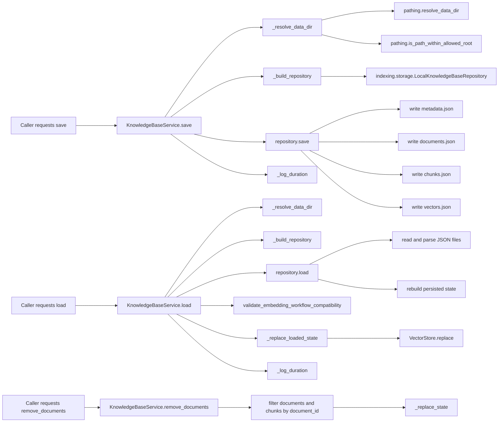

## Concepts Documentation Generation Flow

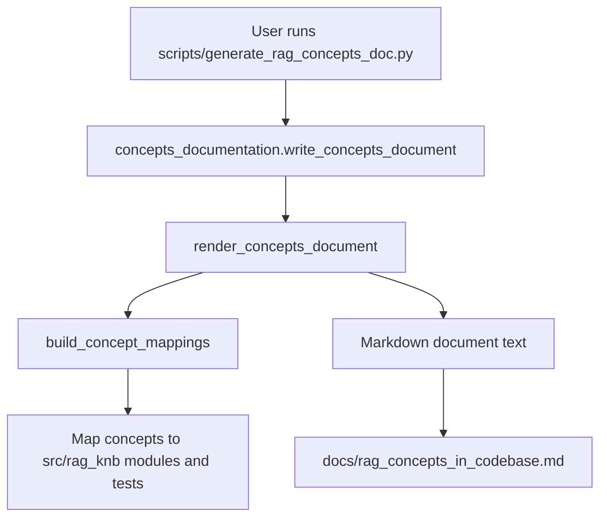

## Class Collaboration Overview

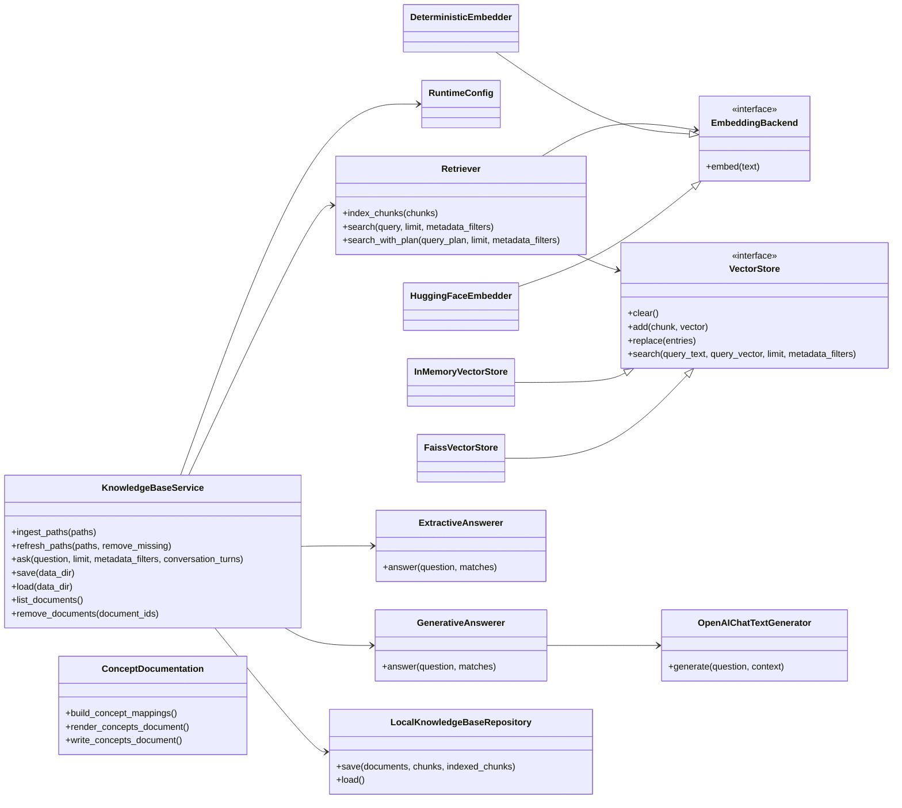

## End-To-End Timing View

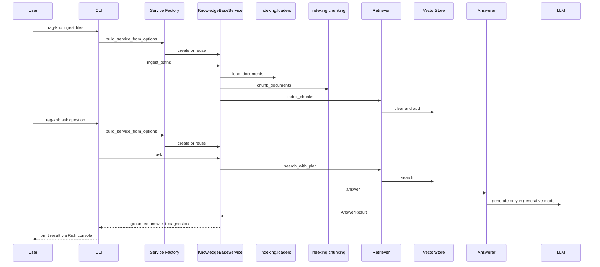
